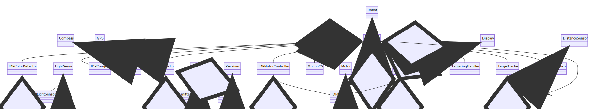

# Team Optimal Robot Controller

This repository contains code for the robot controller, it should be added as a
submodule to the [main Webots project
repository](https://github.com/IDP-L211/simulation).

  

The class diagram is shown below

## Subroutines

  
  
  

## Development

It is useful to set up a proper development environment with the provided
`controller` module (a C interface) included in your linter/IDE and set the
robot controller to `<extern>` in Webots for debugging. More information at
https://cyberbotics.com/doc/guide/using-your-ide?tab-language=python. The main
steps for PyCharm are:

1. Configure the virtual environment in _Project Interpreter_
2. Add the correct Webots `controller` directory (depending on your system and
   Python configuration, `controller/_controller.so` is slightly different) as
   _Content Root_ under _Project Structure_
3. Create a _Run/Debug Configuration_, setting the [relevant environment
   variables](https://cyberbotics.com/doc/guide/running-extern-robot-controllers?tab-language=python)

If you prefer to run controller directly from Webots, have a look at
https://cyberbotics.com/doc/guide/using-python. This is especially important
for people using macOS and Homebrew, you may need to set the full path to your
Python interpreter (get it by `which python3`).
